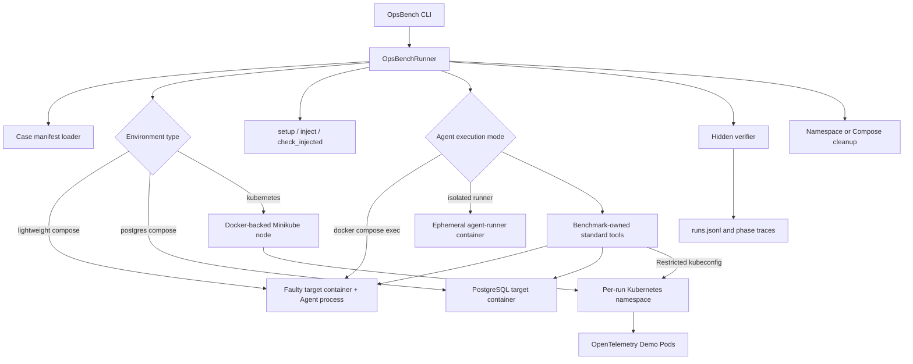

# OpsBench Operations Benchmark

This repository is a compact SWE-bench-like demo for operations incidents. The first case package, `postgres-missing-index-001`, reproduces a PostgreSQL slow-query incident caused by a missing index.

The benchmark shape is intentionally case-package first:

- Each incident lives under `cases/<case-id>/`.
- A runner starts the environment, injects the fault, checks injection, runs a CLI agent, verifies the final state, and records a result.
- Hidden labels are stored for leaderboard slicing and are not passed to agents.
- Agents are normal executables, so ReAct-style, model-backed, or custom scripts can all use the same protocol.

## Layout

```text
opsbench/                         # Python CLI and harness
cases/postgres-missing-index-001/ # Self-contained PostgreSQL case package
cases/*-002 through *-021/        # Lightweight single-target-container incidents
cases/otel-k8s-tci*/              # TCI038-TCI092 Kubernetes incident cases
cases/_kubernetes_otel/           # Canonical generator templates for Kubernetes cases
agents/langchain-react-agent/     # LangChain ReAct/tool agent wrapper
opsbench/kubernetes_cluster.py    # Benchmark-owned Minikube lifecycle
results/runs.jsonl                # Generated run records
results/traces/                   # Generated phase and agent traces
```

## Project Architecture

OpsBench separates benchmark control, fault environments, agent execution, and
scoring. The benchmark process runs on the host. For lightweight cases 002-021,
the evaluated Agent process runs directly inside the faulty `target` container.
PostgreSQL and Kubernetes cases use a separate `agent-runner` because their
targets are a database engine and a cluster rather than a general-purpose
diagnostic environment.



### Component Responsibilities

| Component | Responsibility |
| --- | --- |
| `opsbench.cli` | Validate cases, run one case, manage the local cluster, and print leaderboard results. |
| `opsbench.runner` | Orchestrate lifecycle phases, container execution, timeouts, traces, cleanup, and result recording. |
| `opsbench.cases` | Validate the self-contained case contract and reject paths outside a case directory. |
| `opsbench.kubernetes_cluster` | Start/reuse/delete the `opsbench` Minikube container, own its kubeconfig, and cache the Helm chart. |
| `opsbench.agent_tools` | Define the standard tool contracts shared by all competing agent adapters. |
| `cases/<case-id>` | Package the public task, environment definition, injection scripts, verifier, and hidden labels. |
| `target` in cases 002-021 | Run both the faulty services and the evaluated Agent, giving shell tools the target filesystem, process namespace, network namespace, and cgroup. |
| `agent-runner` | Run agents for PostgreSQL and Kubernetes with only explicitly mounted task, trace, and runtime credentials. |

### Runtime Topology

For the PostgreSQL case, Docker Compose starts a target `db` container and a
separate ephemeral `agent-runner`. The agent reaches PostgreSQL through the
Compose service name `db`.

For lightweight cases 002-021, Compose starts exactly one `target` container.
After injection, the runner uses `docker compose exec -T target /agent/run.sh`.
The Agent is therefore a normal process in the incident environment: its shell
sees the same `/proc`, filesystem, loopback interface, resource limits, logs,
configuration, and fault workloads as the application. No SSH server,
`sshpass`, Docker socket, or second Agent container is involved.

For Kubernetes cases, Minikube uses the Docker driver, so the Kubernetes node
and every OpenTelemetry Demo workload remain inside Docker-managed containers.
The cluster is reused across cases; each run receives a unique namespace and a
fresh agent container:

```text
Docker Desktop
├── opsbench                      # reusable Minikube node container
│   └── namespace per run
│       ├── OpenTelemetry Demo workloads
│       ├── Prometheus / Jaeger / Grafana
│       └── real fault workloads/resources and Kubernetes Events
└── <compose-project>-agent-runner # removed after the agent exits
```

The benchmark kubeconfig is stored under `runtime/kubernetes/` and never uses
the user's default `~/.kube/config`. A namespace-scoped ServiceAccount, Role,
RoleBinding, and one-hour token are generated for the agent. Loopback Minikube
API endpoints are translated to `host.docker.internal` while TLS verification
is retained.
Because all Kubernetes cases share one resource-bounded Minikube node, the
runner holds a cross-process lock for the complete setup/inject/agent/verify/
cleanup lifecycle. Concurrent CLI processes wait their turn instead of
starting multiple full Demo installations and destabilizing the baseline.

### Case Execution Flow

One `opsbench run` follows this sequence:

1. Load and validate `manifest.yaml`, including paths and the exact tool contract.
2. Start Docker Compose or ensure the benchmark-owned Minikube cluster is Ready.
3. Run optional `setup.py`; Kubernetes setup creates a namespace, installs the cached Helm chart, and creates restricted credentials.
4. Run `inject.py` to alter a live resource or start a bounded fault workload.
5. Run `check_injected.py` against live Kubernetes state; the agent is never started if injection is invalid.
6. Mount only the Agent implementation, public task, and trace path. Execute the
   Agent in the case's declared `agent_service`, or start `agent-runner` for
   cases that intentionally use a separate client environment.
7. Let the agent diagnose and repair through the declared standard tools.
8. After the agent exits, run the hidden `verify.py` once from benchmark control.
9. Record phase return codes, durations, verifier checks, score, labels, and traces.
10. Remove the Compose environment or Kubernetes namespace in `finally`, including failed runs.

A scored PASS requires both a zero agent exit code and successful hidden
verification. Repairing the environment and then exhausting the reasoning-loop
limit no longer receives leaderboard credit.

### Isolation and Information Boundaries

The Agent runtime receives:

- The Agent implementation mounted read-only at `/agent`.
- A generated public task mounted read-only at `/task/task.md`.
- A writable Agent-only trace directory at `/trace`. On the host this is the
  `agent/` child of the run trace; benchmark phase logs are outside the mount.
- For Kubernetes only, a namespace-restricted kubeconfig at `/kube/config`.
- The case-declared tool standard and command clients through environment variables.

The Agent does **not** receive the case directory, hidden labels,
scenario JSON, verifier scripts, verifier output, benchmark work directory,
host/admin kubeconfig, Docker socket, or Minikube control credentials. Setup,
injection, scoring, and cleanup remain benchmark-side operations.

Model credentials are injected only into the evaluated Agent process. They are
not part of the target service's startup environment, and tool traces redact
credential-shaped environment values.

### Results and Reuse

Each run appends one record to `results/runs.jsonl` and writes phase logs plus
agent ReAct/tool traces under `results/traces/<run-id>/`. The Minikube node,
downloaded chart, and pulled container images remain cached between cases;
namespaces and agent containers do not. Use `opsbench cluster down` after a batch
to remove the shared Kubernetes node.

The exact TCI038–TCI092 injection semantics and fidelity limitations are
documented in [Kubernetes故障注入说明.md](Kubernetes故障注入说明.md).

The repository also includes 20 lightweight non-Kubernetes cases numbered
002-021. Each starts one Debian-based target limited to 1 CPU, 384 MiB memory and
small tmpfs volumes. They exercise real CPU and memory consumption, descriptor
leaks, byte and inode exhaustion, permissions, listening sockets, startup
failures, PID files, downstream DNS/port/status/payload/timeout faults, feature
flags, file locks, TLS hostname validation and environment overrides. See
[Lightweight容器故障说明.md](Lightweight容器故障说明.md) for the exact live signals.
The target image includes the common Agent runtime, compiles its Python services, and removes source files plus
healthy bootstrap copies before agent access. Public tasks provide only the
service contract; the Agent runs inside the target and must discover effective
configuration, logs, process control and precedence from live state.

## Commands

Validate the demo case:

```bash
python3 -m opsbench.cli validate --case cases/postgres-missing-index-001
```

Run the LangChain ReAct agent:

```bash
python3 -m opsbench.cli run \
  --case cases/postgres-missing-index-001 \
  --agent agents/langchain-react-agent/run.sh \
  --results-dir results
```

Show the leaderboard:

```bash
python3 -m opsbench.cli leaderboard --results results/runs.jsonl
```

Run unit tests:

```bash
python3 -m unittest discover -v
```

## LangChain ReAct Agent

`agents/langchain-react-agent/run.sh` is a real model-backed agent. It runs in the case-declared Agent environment, adapts the benchmark-owned tool standard to LangChain, and calls DeepSeek through an OpenAI-compatible endpoint.

Install the optional agent dependencies:

```bash
python3 -m pip install -r agents/langchain-react-agent/requirements.txt
```

Configure the model:

```bash
export DEEPSEEK_API_KEY=...
export DEEPSEEK_MODEL=deepseek-v4-pro
export DEEPSEEK_BASE_URL=https://api.deepseek.com
export LANGCHAIN_MAX_STEPS=60
```

Run it through the same OpsBench protocol:

```bash
python3 -m opsbench.cli run \
  --case cases/postgres-missing-index-001 \
  --agent agents/langchain-react-agent/run.sh \
  --results-dir results
```

For cases 002-021 the Agent process and its shell tools run directly in `target`.
For PostgreSQL and Kubernetes they run in `agent-runner` with only the declared
network and credentials. Pass/fail depends on model behavior, API availability,
a zero Agent exit code, and hidden verification after the Agent exits.

## Agent Protocol

The runner invokes agents as:

```bash
agent/run.sh \
  --case-dir /abs/path/to/case \
  --task /abs/path/to/generated/task.md \
  --work-dir /abs/path/to/runtime/workspace \
  --timeout-sec 300
```

Useful environment variables:

```text
OPSBENCH_CASE_ID
OPSBENCH_RUN_ID
OPSBENCH_AGENT_CONTAINER
OPSBENCH_COMPOSE_PROJECT
OPSBENCH_SHELL_SERVICE
OPSBENCH_TRACE_DIR
OPSBENCH_AGENT_TRACE_DIR
```

With Docker enabled, cases declaring `environment.agent_service` launch through
`docker compose exec -T <service> /agent/run.sh ...`; other cases launch through
`docker compose run --rm --build agent-runner ...`. The runner always performs
injection, scoring, and final verification outside the Agent after it exits.

## Standard Tool Contracts

Every ranked agent for the same case receives the same benchmark-owned tool
surface. The contract is selected by the case manifest, not by the agent:

- `postgres-operations-v2`: `shell`, `inspect_database`, `query_database`, and
  `explain_query`. SQL tools use the configured PostgreSQL connection and permit
  both diagnosis and intentional DDL repair.
- `linux-operations-v2`: `shell`, `read_logs`, `inspect_processes`,
  `inspect_sockets`, `query_host_metrics`, `inspect_filesystem`, `probe_http`,
  `inspect_file`, `edit_file`, and `manage_service`. These execute directly in
  the faulty target container.
- `kubernetes-observability-v1`: `shell`, `kubectl_logs`, `list_metrics`,
  `query_metrics`, `search_traces`, `get_trace`, and `query_logs`.

Agent frameworks and reasoning-loop designs may differ, but their adapters must
expose exactly the manifest contract in the declared order. Structured tools
produce one trace file per invocation; `shell` remains an audited fallback for
specialist commands that do not fit a stable typed operation. The tool surface
does not include injection, verifier, Docker, hidden metadata, or host access.

The verifier is bench infrastructure, not an agent action. Agents do not receive its command or output; OpsBench runs it once after the agent process finishes.

The complete parameters, side effects, execution boundaries, and leaderboard
fairness rules for cases 001-021 are documented in
[运维工具标准.md](运维工具标准.md).

## Kubernetes OpenTelemetry Cases

The repository includes 55 Kubernetes cases generated from `故障.md`, covering
TCI038 through TCI092. Every fault has its own `cases/otel-k8s-tci*/` directory.
Each generated directory is self-contained and follows the same case layout:

```text
manifest.yaml
docker-compose.yaml
otel-values.yaml
task.md
scripts/{common,faults,setup,inject,check_injected,verify,cleanup}.py
hidden/{labels.yaml,scenario.json}
```

`cases/_kubernetes_otel/` is only the canonical generation source; runtime
manifests do not reference files outside their own case directory.
All cases use the baseline from `基准环境.md`:

- Docker Desktop plus Minikube 1.33 or newer. OpsBench automatically creates a
  Docker-backed Kubernetes 1.30 cluster with the dedicated `opsbench` profile.
- At least 6 GiB of available application memory.
- OpenTelemetry Demo installed from
  `open-telemetry/opentelemetry-demo` with Helm Chart 0.11.0 by default.
- A dedicated namespace for each run, followed by automatic cleanup.

Faults are injected through live Kubernetes resources: bounded stress Pods,
Deployment and Service mutations, NetworkPolicies, Pending workloads,
ResourceQuotas, Secrets, Ingresses, and recoverable Node scheduling changes.
`check_injected.py` and `verify.py` inspect those resources directly; an
observation ConfigMap and Warning Events are diagnostic clues only and never
count as proof of injection or repair. CCE/EVS/OBS/ELB concepts that have no
real cloud control plane in local Minikube use a real, recoverable Kubernetes
failure with the same operational symptom. The injection document states the
fidelity boundary for every case.

Fault objects do not use names such as `opsbench-fault` or labels such as
`fault=true`/case IDs. Workload pressure is injected as a neutral helper
container in the affected Deployment, so an agent must correlate workload
specification with observed signals instead of deleting an explicitly marked
object.

The Kubernetes cases use the uniform `kubernetes-observability-v1` standard.
Every competing agent receives the same benchmark-owned tools for every
Kubernetes case:

- `shell`: inspect and repair resources with the installed command-line clients.
- `kubectl_logs`: read current or previous Pod logs in the case namespace.
- `list_metrics`: discover Prometheus metric names with optional filtering,
  including kubelet/cAdvisor container CPU, memory, filesystem, and network metrics.
- `query_metrics`: run instant PromQL queries against Demo Prometheus.
- `search_traces` and `get_trace`: search and retrieve Jaeger service traces,
  operations, errors, durations, and cross-service spans.
- `query_logs`: search OpenSearch when present; chart 0.11.0 has no OpenSearch,
  so the same tool falls back to read-only namespace Pod-log search.

Grafana is a visualization UI rather than a separate telemetry store. Its
configured data sources are the same Prometheus and Jaeger instances queried
by the agent tools, so agents use the underlying APIs directly and avoid UI
automation. Hidden verification also queries Prometheus through the Kubernetes
Service Proxy. CPU and memory pressure cases must cross their active cAdvisor
threshold during injection and fall below a separate recovery threshold after
repair; resource deletion alone is insufficient.

The observability tools discover Services in the current namespace and use the
Kubernetes API Service Proxy. They are read-only and do not expose arbitrary
network destinations. Scenario-appropriate clients are also installed in the
agent container and declared per case:

- Workload, node, scheduling, storage: `kubectl`, `helm`, `jq`.
- Network and ingress: `kubectl`, `helm`, `curl`, `jq`.
- DNS: `kubectl`, `helm`, `dig`, `nslookup`, `jq`.

During setup, the runner creates a short-lived ServiceAccount and namespace Role
for the run, plus a narrow shared ClusterRole that permits node get/list and
cordon/taint repair but not node deletion. Only that restricted kubeconfig is mounted read-only into the
isolated agent container; the host/admin kubeconfig, case directory, generated
work directory, and hidden benchmark controls are not mounted.

This tool surface follows the official
[OpenTelemetry Demo Helm deployment](https://opentelemetry.io/docs/platforms/kubernetes/helm/demo/)
and its Prometheus and Jaeger backends.

The chart 0.11.0 `v1.0.0-featureflagservice` image is amd64-only while the
benchmark node on Apple Silicon is arm64. Its emulated `/app/bin/server`
process can segfault during database migration even though PostgreSQL is
healthy. Setup annotates this known baseline limitation and excludes it from
the health gate; agents are instructed not to treat it as the injected fault.
The same old chart originally referenced `jaegertracing/all-in-one:latest`;
the benchmark pins multi-architecture Jaeger `1.39` so its trace query API
remains compatible with `search_traces` and `get_trace`.

The first Kubernetes run automatically creates the reusable local cluster and
caches the Helm chart. It never reads or changes the user's default kubeconfig.
The following commands manage that benchmark-owned cluster explicitly:

```bash
python3 -m opsbench.cli cluster up
python3 -m opsbench.cli cluster status
python3 -m opsbench.cli cluster down
```

Run a case:

```bash
python3 -m opsbench.cli run \
  --case cases/otel-k8s-tci061-image-reference \
  --agent agents/langchain-react-agent/run.sh \
  --results-dir results
```

Useful environment overrides:

```text
OPSBENCH_OTEL_CHART_VERSION
OPSBENCH_OTEL_SKIP_INSTALL
OPSBENCH_MINIKUBE_PROFILE
OPSBENCH_MINIKUBE_CPUS
OPSBENCH_MINIKUBE_MEMORY_MB
OPSBENCH_KUBERNETES_VERSION
```

`OPSBENCH_OTEL_SKIP_INSTALL=1` is intended only for development against a
namespace where the baseline application lifecycle is managed separately.
Regenerate the case directories after editing `故障.md` or the scenario catalog:

```bash
python3 tools/generate_kubernetes_cases.py
python3 tools/generate_fault_injection_docs.py
```

## Case Notes

`postgres-missing-index-001` starts from a healthy PostgreSQL database with an index on `orders.customer_id`. The injection script drops that index. The verifier checks that the workload still returns data and that PostgreSQL execution time for the target order-history query is below the configured thresholds.
